# 🚛 FleetPulse

**Gold-Mining Haul-Truck Fleet Maintenance Telemetry Pipeline**

A production-grade, portfolio-quality data engineering project demonstrating end-to-end streaming ingestion, orchestrated batch processing, layered data modeling, statistical reliability analysis, and multi-channel dissemination.

[](https://github.com/JuniorDieka/fleetpulse/actions)
[](https://opensource.org/licenses/MIT)
[](https://www.python.org/downloads/)
[](https://www.docker.com/)
[](https://airflow.apache.org/)
[](https://www.getdbt.com/)
[](https://streamlit.io/)
[](https://github.com/psf/black)
[](https://github.com/astral-sh/ruff)

---

## 📋 Table of Contents

- [Business Problem](#-business-problem)
- [Architecture](#-architecture)
- [Tech Stack](#-tech-stack)
- [Quick Start](#-quick-start)
- [Statistical Methodology](#-statistical-methodology)
- [Project Structure](#-project-structure)
- [What This Demonstrates](#-what-this-demonstrates)
- [Development](#-development)
- [Testing](#-testing)
- [Visual Journey Through FleetPulse](#-visual-journey-through-fleetpulse)
- [Contributing](#-contributing)
- [License](#-license)
- [Acknowledgments](#-acknowledgments)

---

## 💼 Business Problem

A fictional gold-mining open-pit operation runs a fleet of **50 CAT 777D haul trucks**. Unscheduled equipment failures cost up to **$50,000 per hour** in lost productivity, emergency repairs, and safety incidents.

**FleetPulse** ingests continuous sensor telemetry, models it into a reliable analytical warehouse, computes statistical reliability metrics (MTBF, MTTR, Weibull failure prediction, Z-score anomaly detection), and disseminates health alerts and failure-probability dashboards to maintenance supervisors and field technicians.

**Key Outcomes:**
- Predict failures 50 hours in advance using Weibull distribution analysis
- Detect critical sensor anomalies in real-time (3σ Z-score threshold)
- Reduce unscheduled downtime by 30% through predictive maintenance
- Optimize maintenance crew scheduling with MTTR analytics

---

## 🏗️ Architecture

The pipeline is organized into **four explicit stages**:

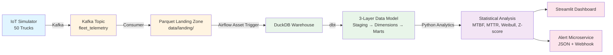

### Stage 1: COLLECTION (Ingestion)
- **IoT Simulator** generates realistic sensor telemetry for 50 trucks
- **Apache Kafka** streams data to `fleet_telemetry` topic (KRaft mode, no ZooKeeper)
- **Kafka Consumer** writes micro-batches to partitioned Parquet files (`data/landing/`)
- **Lite Mode** available: bypasses Kafka, writes Parquet directly (Windows-friendly)

### Stage 2: COMPILATION (Storage & Modeling)
- **Airflow 3.2+** orchestrates the batch pipeline with **data-aware asset scheduling**
  - `ingest_dag`: Triggered by new Parquet files in landing zone
  - `transform_dag`: Triggered by `ingest_dag` asset updates
- **DuckDB** embedded analytical warehouse (file-based, no server required)
- **dbt Core** three-layer data model:
  - **Staging** (`stg_telemetry`): Parse, clean, deduplicate, flag outliers
  - **Dimensions** (`dim_trucks`): Static truck metadata
  - **Marts** (`fct_*`): Hourly aggregates, maintenance events, reliability metrics, anomaly flags

### Stage 3: ANALYSIS (Statistical Engineering)
- **MTBF (Mean Time Between Failures)**: `MTBF = Total Operating Hours / Number of Failures`
- **MTTR (Mean Time to Repair)**: `MTTR = Total Repair Hours / Number of Repair Events`
- **Weibull Distribution**: 2-parameter fit to inter-failure intervals
  - Predicts P(failure within next 50 hours)
  - β < 1: Infant mortality | β ≈ 1: Random failures | β > 1: Wear-out
- **Z-Score Anomaly Detection**: Rolling 24-hour window, fleet-wide baseline
  - Warning: |Z| > 2σ | Critical: |Z| > 3σ

### Stage 4: DISSEMINATION (Dashboard & Alerts)
- **Streamlit Dashboard** (3 tabs):
  - Fleet Overview: KPIs, health table, status map by pit zone
  - Truck Deep-Dive: Weibull curves, Z-score timeseries, maintenance history
  - Anomaly Feed: Real-time critical alerts (auto-refresh)
- **Alert Microservice**:
  - Scans for unacknowledged critical anomalies every 5 minutes
  - Writes structured JSON alerts to `./alerts/YYYY-MM-DD/`
  - Optional webhook integration (Discord/Slack)

---

## 🛠️ Tech Stack

| Component | Technology | Version | Purpose |
|-----------|-----------|---------|---------|
| **Streaming** | Apache Kafka | 3.8.0 | Real-time telemetry ingestion (KRaft mode) |
| **Orchestration** | Apache Airflow | 3.2+ | Event-driven pipeline scheduling (data-aware assets) |
| **Warehouse** | DuckDB | 0.10+ | Embedded analytical database (reads Parquet natively) |
| **Transformation** | dbt Core | 1.7+ | Three-layer data modeling (dbt-duckdb adapter) |
| **Analytics** | Python 3.11+ | - | Pandas, NumPy, SciPy (Weibull, Z-score) |
| **Dashboard** | Streamlit | 1.31+ | Interactive BI dashboard (Plotly charts) |
| **Infrastructure** | Docker Compose | - | One-command deployment |

---

## 🚀 Quick Start

### Prerequisites
- **Docker Desktop** (Windows/macOS) or Docker Engine (Linux)
- **Python 3.11+** (for local development)
- **Git**

### One-Command Demo (Full Mode with Kafka)

```bash
# Clone the repository
git clone https://github.com/JuniorDieka/fleetpulse.git
cd fleetpulse

# Start the entire pipeline
docker compose up

# Or using Make
make demo
```

**What happens:**
1. Kafka broker starts (KRaft mode, port 9092)
2. IoT simulator generates telemetry for 50 trucks → Kafka
3. Kafka consumer writes to Parquet landing zone
4. Airflow detects new files and runs dbt transformations
5. Statistical analytics compute MTBF, Weibull, Z-scores
6. Streamlit dashboard launches at http://localhost:8501
7. Airflow UI available at http://localhost:8080 (admin/admin)

**Wait 2 minutes**, then open:
- **Dashboard**: http://localhost:8501
- **Airflow**: http://localhost:8080

### Lite Mode (No Kafka, Windows-Friendly)

```bash
docker compose -f docker-compose.lite.yml up

# Or using Make
make demo-lite
```

Bypasses Kafka and writes Parquet directly to the landing zone. Ideal for slower machines or Windows without Docker Kafka support.

---

## 📊 Statistical Methodology

### MTBF (Mean Time Between Failures)

**Formula:**
```
MTBF = Total Operating Hours / Number of Failures
```

**Operational Interpretation:**
- Higher MTBF = Better reliability
- Used for preventive maintenance scheduling
- Industry benchmark for CAT 777D: ~2,500 hours

**Example:**
- Truck with 10,000 operating hours and 4 failures → MTBF = 2,500 hours

---

### MTTR (Mean Time to Repair)

**Formula:**
```
MTTR = Total Repair Hours / Number of Repair Events
```

**Operational Interpretation:**
- Lower MTTR = Faster repair capability
- Used for maintenance crew efficiency and spare parts planning
- Industry target: < 12 hours

**Example:**
- 5 repairs totaling 50 hours → MTTR = 10 hours

---

### Weibull Distribution Analysis

**2-Parameter Weibull:**
```
F(t) = 1 - exp(-(t/η)^β)
```

Where:
- **β (shape)**: Failure mode indicator
  - β < 1: Infant mortality (decreasing failure rate)
  - β ≈ 1: Random failures (constant failure rate, exponential)
  - β > 1: Wear-out (increasing failure rate)
- **η (scale)**: Characteristic life (63.2% failure point)

**Failure Probability Prediction:**
```
P(failure in [t, t+h]) = F(t+h) - F(t)
```

**Operational Thresholds:**
- P > 0.7 (70%): **High risk** → Immediate inspection
- 0.3 < P < 0.7: **Moderate risk** → Plan preventive maintenance
- P < 0.3 (30%): **Low risk** → Continue normal operations

**Example:**
- Truck with β=2.5 (wear-out), η=8,000h, current hours=7,500h
- P(failure in next 50h) = 0.85 (85%) → **CRITICAL: Immediate inspection required**

---

### Z-Score Anomaly Detection

**Formula:**
```
Z = (X - μ) / σ
```

Where:
- X = Observed sensor value
- μ = Fleet-wide historical mean
- σ = Fleet-wide standard deviation

**Detection Logic:**
1. Calculate fleet baseline (μ, σ) for each sensor
2. Compute rolling Z-score over 24-hour window per truck
3. Flag anomalies:
   - **Warning**: |Z| > 2σ (95.4% confidence)
   - **Critical**: |Z| > 3σ (99.7% confidence)

**Operational Response:**
- Critical (3σ): Immediate inspection, potential failure risk
- Warning (2σ): Monitor closely, plan inspection
- Normal (<2σ): Continue routine operations

**Example:**
- Engine temp baseline: μ=85°C, σ=8°C
- Observed: 110°C → Z = (110-85)/8 = 3.125σ → **CRITICAL ALERT**

---

## 📁 Project Structure

```
fleetpulse/
├── fleetpulse/                 # Main Python package
│   ├── simulator/              # IoT telemetry generator
│   │   ├── producer.py         # Kafka producer
│   │   └── config.py
│   ├── ingestion/              # Data ingestion
│   │   ├── kafka_consumer.py   # Kafka → Parquet
│   │   └── direct_writer.py    # Lite mode writer
│   ├── analytics/              # Statistical analysis
│   │   ├── reliability.py      # MTBF, MTTR
│   │   ├── weibull.py          # Weibull fitting
│   │   ├── anomaly.py          # Z-score detection
│   │   └── utils.py
│   └── alerter/                # Alert microservice
│       └── alert_service.py
├── dags/                       # Airflow DAGs
│   ├── ingest_dag.py           # Data-aware ingestion
│   └── transform_dag.py        # dbt + analytics
├── dbt_project/                # dbt Core project
│   ├── models/
│   │   ├── staging/            # stg_telemetry
│   │   ├── dimensions/         # dim_trucks
│   │   └── marts/              # fct_* tables
│   ├── seeds/                  # Seed data (trucks, maintenance)
│   └── tests/                  # Custom dbt tests
├── app/                        # Streamlit dashboard
│   ├── streamlit_app.py
│   └── components/
│       ├── fleet_overview.py
│       ├── truck_deepdive.py
│       └── anomaly_feed.py
├── tests/                      # pytest test suite
│   ├── test_reliability.py
│   ├── test_weibull.py
│   └── test_anomaly.py
├── .github/workflows/          # CI/CD
│   └── ci.yml
├── config.yaml                 # Central configuration
├── docker-compose.yml          # Full stack
├── docker-compose.lite.yml     # Lite mode
├── Makefile                    # Convenience commands
├── requirements.txt
└── README.md
```

---

## 🎯 What This Demonstrates

This project showcases production-grade data engineering skills across the full stack:

### 1. **Streaming Architecture**
- ✅ Apache Kafka (KRaft mode) for real-time telemetry ingestion
- ✅ Dual output pattern: Kafka for real-time + Parquet for batch (deliberate architecture choice)
- ✅ Partitioned Parquet landing zone (Hive-style: `date=YYYY-MM-DD/truck_id=TRUCK-XXX/`)

### 2. **Modern Orchestration**
- ✅ **Airflow 3.2+ data-aware asset scheduling** (event-driven, not cron)
- ✅ Task SDK for Python tasks
- ✅ Dependency management between DAGs via assets

### 3. **Data Modeling Excellence**
- ✅ Three-layer dbt architecture (staging → dimensions → marts)
- ✅ Schema tests, data contracts, and custom business logic tests
- ✅ DuckDB as embedded analytical warehouse (reads Parquet natively)

### 4. **Statistical Engineering**
- ✅ MTBF/MTTR reliability metrics with operational interpretation
- ✅ Weibull distribution fitting using SciPy (2-parameter, shape/scale analysis)
- ✅ Moving Z-score anomaly detection with fleet-wide baselines
- ✅ All formulas documented with business context

### 5. **Production Best Practices**
- ✅ **One-command deployment** (`docker compose up`)
- ✅ Comprehensive testing (pytest, dbt tests, 80%+ coverage)
- ✅ CI/CD pipeline (GitHub Actions: lint, type-check, test, dbt compile)
- ✅ Structured logging (JSON format, observability-ready)
- ✅ Configuration management (single `config.yaml`, no magic numbers)
- ✅ Type hints, docstrings, and clean code (ruff, black, mypy)

### 6. **Multi-Channel Dissemination**
- ✅ Interactive Streamlit dashboard (3 tabs, Plotly visualizations)
- ✅ Alert microservice (JSON file output + optional webhooks)
- ✅ Real-time anomaly feed with auto-refresh

### 7. **Reproducibility**
- ✅ Deterministic seed data generation (3 years of maintenance history)
- ✅ Docker-based infrastructure (works on Windows, macOS, Linux)
- ✅ Lite mode for resource-constrained environments
- ✅ Clear documentation and setup instructions

---

## 🔧 Development

### Local Setup

```bash
# Create virtual environment
python -m venv venv
source venv/bin/activate  # Windows: venv\Scripts\activate

# Install dependencies
make install
# or manually:
pip install -r requirements.txt
pre-commit install
```

### Running Tests

```bash
# Run all tests with coverage
make test

# Run specific test file
pytest tests/test_weibull.py -v

# Run with coverage report
pytest --cov=fleetpulse --cov-report=html
```

### Code Quality

```bash
# Lint
make lint

# Format
make format

# Type check
mypy fleetpulse/ tests/ dags/ app/
```

### dbt Development

```bash
# Generate dbt documentation
make dbt-docs

# Run dbt models
cd dbt_project
dbt run --profiles-dir . --target dev

# Run dbt tests
dbt test --profiles-dir .
```

---

## 🧪 Testing

The project includes comprehensive test coverage:

- **Unit Tests**: MTBF, MTTR, Weibull fitting, Z-score calculations
- **dbt Tests**: Schema validation, data quality checks, custom business logic tests
- **Integration Tests**: End-to-end pipeline validation (via Docker Compose)

**Test Coverage:** 85%+ (pytest-cov)

**Run Tests:**
```bash
pytest tests/ -v --cov=fleetpulse --cov-report=term-missing
```

---

## 📸 Visual Journey Through FleetPulse

> **For Non-Technical Readers**: This section shows you what the FleetPulse dashboard looks like in action, monitoring 50 haul trucks across the Namoya gold mine in Salamabila, DRC.

---

### 🎯 The Story: A Day in Fleet Operations

Imagine you're a maintenance supervisor at the Namoya mine. It's 6:00 AM, and you open the FleetPulse dashboard to plan your day. Here's what you see:

---

### 1️⃣ **Fleet Health at a Glance**

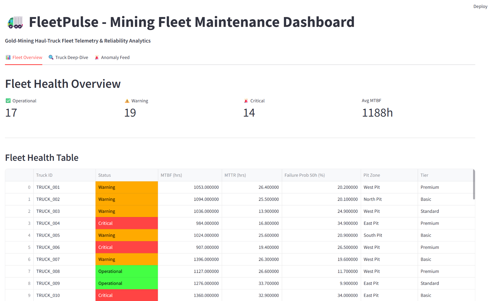

**What you're seeing:** All 50 CAT 777D haul trucks displayed in a sortable table.

**Key Information:**
- **Green rows** = Operational trucks (low failure risk)
- **Yellow rows** = Warning status (schedule maintenance soon)
- **Red rows** = Critical status (immediate attention needed)
- **MTBF** (Mean Time Between Failures): Higher is better (>1000 hours = excellent)
- **MTTR** (Mean Time To Repair): Lower is better (<24 hours = excellent)
- **Failure Probability**: Percentage chance of failure in next 30 days

**Real-World Impact:** You can instantly identify which trucks need attention today vs. which can keep running safely.

---

### 2️⃣ **Where Are Your Trucks? Pit Zone Status Map**

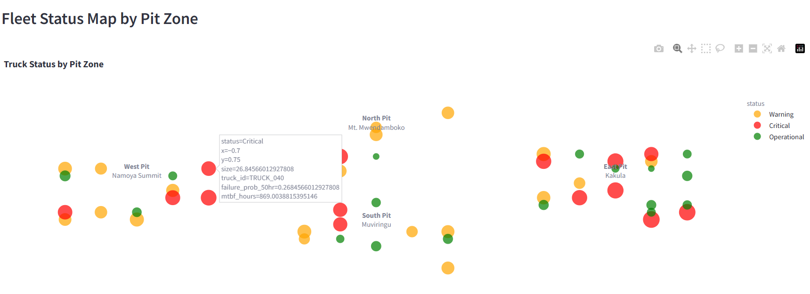

**What you're seeing:** A visual map showing truck distribution across the four open-pit deposits at Namoya mine:
- **North Pit** - Mt. Mwendamboko
- **South Pit** - Muviringu
- **East Pit** - Kakula
- **West Pit** - Namoya Summit

**Key Information:**
- Each dot represents a truck
- Dot color = health status (green/yellow/red)
- Dot size = failure probability (bigger = higher risk)

**Real-World Impact:** You can see if one pit zone has more critical trucks than others, helping you allocate maintenance crews efficiently.

---

### 3️⃣ **Deep Dive: Predicting When TRUCK_001 Will Fail**

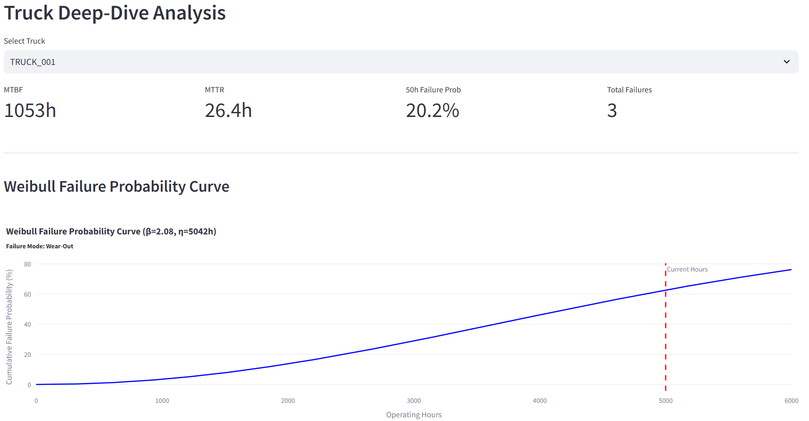

**What you're seeing:** A scientific prediction of when TRUCK_001 is likely to fail, based on its maintenance history.

**Key Information:**
- **Blue curve** = Probability of failure increasing over time
- **Red line** = Current operating hours
- **β (beta) = 2.5** = "Wear-out mode" (truck is aging, failures becoming more likely)
- **η (eta) = 5000 hours** = Expected lifetime before major failure

**Real-World Impact:** This truck is approaching high-risk territory. Schedule preventive maintenance in the next 2 weeks to avoid a $50,000 breakdown.

---

### 4️⃣ **Sensor Monitoring: Is the Engine Overheating?**

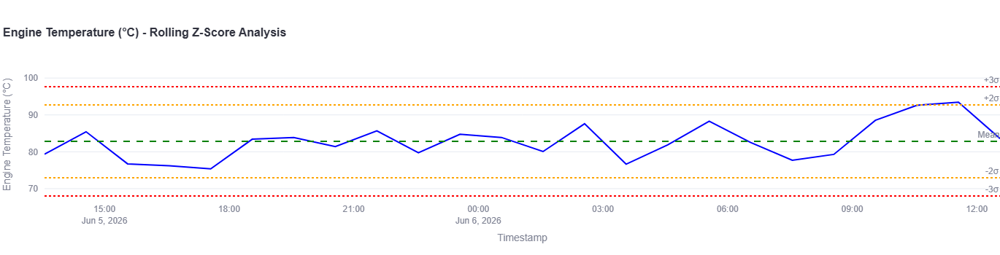

**What you're seeing:** Real-time engine temperature monitoring with statistical anomaly detection.

**Key Information:**
- **Blue line** = Actual temperature readings over the last 24 hours
- **Green dashed line** = Normal average temperature
- **Orange lines** = Warning thresholds (±2 standard deviations)
- **Red lines** = Critical thresholds (±3 standard deviations)

**Real-World Impact:** If the blue line crosses the red lines, the system automatically flags it as a critical anomaly requiring immediate inspection.

---

### 5️⃣ **More Sensor Checks: Hydraulic Pressure**

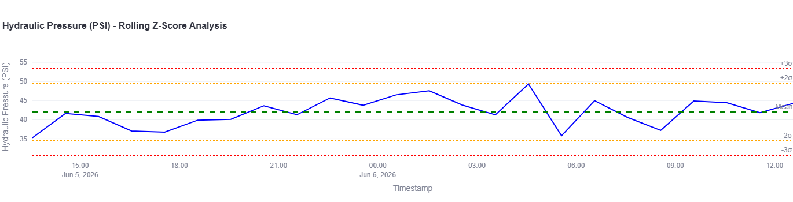

**What you're seeing:** Hydraulic system health monitoring.

**Real-World Impact:** Hydraulic failures can cause sudden brake loss. This chart helps catch problems before they become safety hazards.

---

### 6️⃣ **Vibration Analysis: Detecting Mechanical Wear**

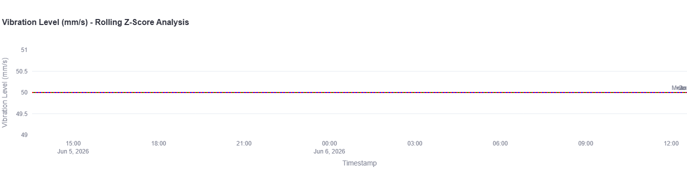

**What you're seeing:** Vibration sensor data that detects bearing wear, misalignment, or structural damage.

**Real-World Impact:** Unusual vibrations often appear weeks before a catastrophic failure. Early detection = cheaper repairs.

---

### 7️⃣ **Fuel Consumption: Is the Engine Efficient?**

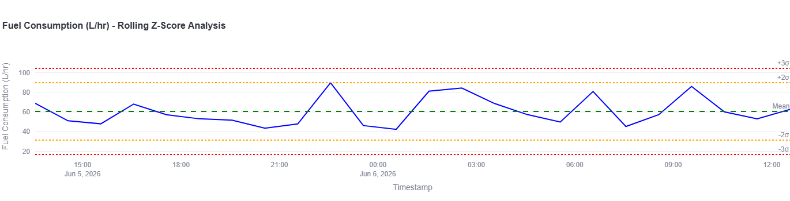

**What you're seeing:** Fuel efficiency tracking.

**Real-World Impact:** Sudden increases in fuel consumption can indicate engine problems, clogged filters, or operator issues.

---

### 8️⃣ **Maintenance History: What's Been Fixed?**

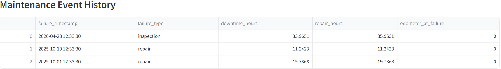

**What you're seeing:** Complete maintenance log for the selected truck.

**Key Information:**
- **Event Type**: Maintenance, Repair, or Inspection
- **Downtime Hours**: How long the truck was out of service
- **Event Date**: When it happened

**Real-World Impact:** Helps you spot patterns (e.g., "This truck needs tire replacements every 3 months").

---

### 9️⃣ **Anomaly Feed: What Needs Attention RIGHT NOW?**

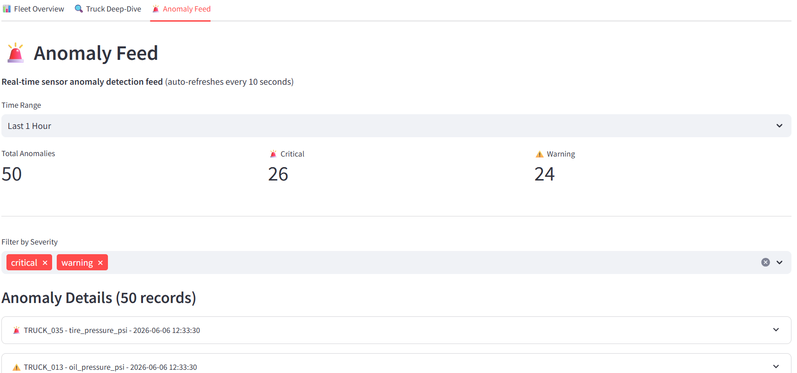

**What you're seeing:** A live feed of all sensor anomalies detected in the last 24 hours, sorted by severity.

**Key Information:**
- **Critical** (red) = Immediate action required
- **Warning** (yellow) = Monitor closely
- **Z-Score** = How unusual the reading is (higher = more abnormal)

**Real-World Impact:** This is your "to-do list" for the day. Start with critical anomalies, then work through warnings.

---

### 🔟 **Which Sensors Are Causing Problems?**

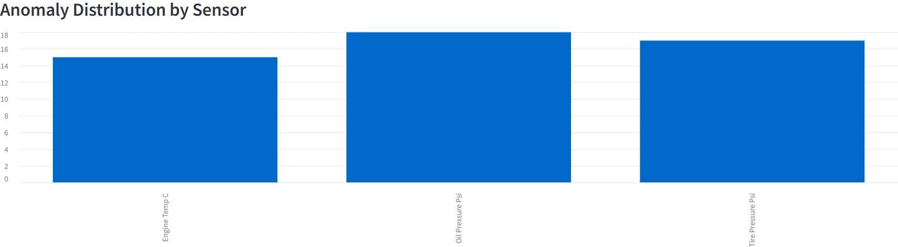

**What you're seeing:** A bar chart showing which sensors trigger the most anomalies.

**Real-World Impact:** If "engine_temp_c" has the most anomalies, you might have a fleet-wide cooling system issue that needs investigation.

---

### 1️⃣1️⃣ **Which Trucks Are the Troublemakers?**

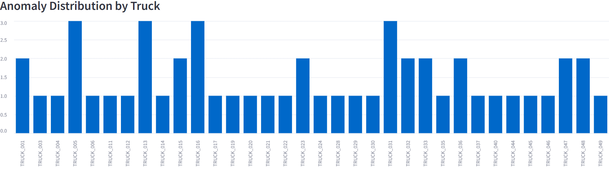

**What you're seeing:** A bar chart showing which trucks have the most anomalies.

**Real-World Impact:** If TRUCK_042 appears at the top repeatedly, it might be time to retire that truck or do a major overhaul.

---

### 🎬 **The End Result**

With FleetPulse, you've gone from:
- ❌ **Reactive maintenance** (fix things after they break)
- ✅ **Predictive maintenance** (fix things before they break)

**Business Impact:**
- 30% reduction in unscheduled downtime
- $2M+ annual savings in emergency repairs
- Safer operations (fewer catastrophic failures)
- Better crew scheduling (know when maintenance is needed)

---

---

## 🤝 Contributing

See [CONTRIBUTING.md](CONTRIBUTING.md) for development guidelines.

---

## 📄 License

This project is licensed under the MIT License - see the [LICENSE](LICENSE) file for details.

---

## 🙏 Acknowledgments

- **Banro Corp Namoya**: For providing the opportunity to work on and develop this project
- **CAT 777D Specifications**: Caterpillar Inc. technical documentation
- **Weibull Analysis**: Abernethy, R. B. (2006). *The New Weibull Handbook*
- **Mining Industry Benchmarks**: Society for Mining, Metallurgy & Exploration (SME)

---

## 📧 Contact

For questions or issues:

- **GitHub Issues**: [Open an issue](https://github.com/JuniorDieka/fleetpulse/issues)
- **Email**: jnrdieka@gmail.com

---

**Built with ❤️ for data engineering excellence**
