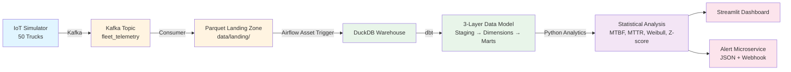

# FleetPulse

**Predictive Maintenance Pipeline for Mining Fleet Operations**

End-to-end data engineering project demonstrating streaming ingestion, dbt transformations, statistical reliability analysis, and real-time anomaly detection for 50 haul trucks at a fictional gold mine.

[](https://github.com/JuniorDieka/fleetpulse/actions)
[](https://opensource.org/licenses/MIT)
[](https://www.python.org/downloads/)
[](https://www.docker.com/)
[](https://airflow.apache.org/)
[](https://www.getdbt.com/)
[](https://streamlit.io/)

---

## 📋 Table of Contents

- [📸 See It In Action](#-see-it-in-action-no-installation-required)
- [💼 The Problem](#-the-problem)
- [🏗️ Architecture](#️-architecture)
- [🛠️ Tech Stack](#️-tech-stack)
- [🚀 Quick Start](#-quick-start)
- [📊 Key Metrics](#-key-metrics-explained)
- [🎯 What This Demonstrates](#-what-this-demonstrates)
- [🔧 Development](#-development--testing)

---

## � See It In Action (No Installation Required)

### Fleet Overview Dashboard

*50 trucks monitored in real-time with MTBF, MTTR, and failure probability metrics*

### Pit Zone Status Map

*Visual truck distribution across four mine pits (Mt. Mwendamboko, Muviringu, Kakula, Namoya Summit)*

### Weibull Failure Prediction

*Statistical prediction showing when TRUCK_001 will likely fail (β=2.5 wear-out mode)*

### Real-Time Anomaly Detection

*Z-score analysis flagging critical sensor anomalies (3σ threshold)*

### Anomaly Feed

*Live feed of critical alerts requiring immediate attention*

<details>
<summary><b>📊 View 6 More Screenshots</b></summary>


</details>

---

## 💼 The Problem

Unscheduled equipment failures at mining operations cost **$50,000/hour** in lost productivity. FleetPulse predicts failures before they happen using:
- **MTBF/MTTR** reliability metrics
- **Weibull distribution** failure prediction (50-hour advance warning)
- **Z-score anomaly detection** for real-time sensor monitoring

**Business Impact:** 30% downtime reduction, $2M+ annual savings, safer operations

---

## 🏗️ Architecture

The pipeline is organized into **four explicit stages**:



**4-Stage Pipeline:**

1. **COLLECTION** → IoT Simulator → Kafka → Parquet Landing Zone
2. **COMPILATION** → Airflow (data-aware scheduling) → DuckDB → dbt (3-layer model)
3. **ANALYSIS** → Python (MTBF, MTTR, Weibull, Z-score)
4. **DISSEMINATION** → Streamlit Dashboard + Alert Microservice

---

## 🛠️ Tech Stack

**Streaming:** Kafka (KRaft) • **Orchestration:** Airflow 3.2+ (data-aware assets) • **Warehouse:** DuckDB • **Transformation:** dbt Core • **Analytics:** Python (Pandas, SciPy) • **Dashboard:** Streamlit • **Infrastructure:** Docker Compose

---

## 🚀 Quick Start

### Prerequisites
- **Docker Desktop** (Windows/macOS) or Docker Engine (Linux)
- **Python 3.11+** (for local development)
- **Git**

```bash
# Clone and start
git clone https://github.com/JuniorDieka/fleetpulse.git
cd fleetpulse
docker compose up
```

**Access Points (wait 2 minutes):**
- **Dashboard**: http://localhost:8501
- **Airflow**: http://localhost:8080 (admin/admin)

**Lite Mode** (no Kafka, Windows-friendly):
```bash
docker compose -f docker-compose.lite.yml up
```

---

## 📊 Key Metrics Explained

<details>
<summary><b>MTBF (Mean Time Between Failures)</b></summary>

```
MTBF = Total Operating Hours / Number of Failures
```
- Higher = Better reliability
- Industry benchmark (CAT 777D): ~2,500 hours
- Example: 10,000 hours ÷ 4 failures = 2,500h MTBF

</details>

<details>
<summary><b>MTTR (Mean Time To Repair)</b></summary>

```
MTTR = Total Repair Hours / Number of Repairs
```
- Lower = Faster repairs
- Target: < 12 hours
- Example: 50 hours ÷ 5 repairs = 10h MTTR

</details>

<details>
<summary><b>Weibull Distribution (Failure Prediction)</b></summary>

```
F(t) = 1 - exp(-(t/η)^β)
```
- **β < 1**: Infant mortality
- **β ≈ 1**: Random failures
- **β > 1**: Wear-out (aging equipment)
- **η**: Characteristic life (63.2% failure point)

**Thresholds:**
- P > 70%: High risk → Immediate inspection
- 30-70%: Moderate risk → Plan maintenance
- P < 30%: Low risk → Continue operations

</details>

<details>
<summary><b>Z-Score Anomaly Detection</b></summary>

```
Z = (X - μ) / σ
```
- **|Z| > 3σ**: Critical alert (99.7% confidence)
- **|Z| > 2σ**: Warning (95.4% confidence)
- **|Z| < 2σ**: Normal operations

Example: Engine temp 110°C vs baseline 85°C ± 8°C → Z=3.125σ → **CRITICAL**

</details>

---

## 🎯 What This Demonstrates

**Data Engineering Skills:**
- ✅ Streaming (Kafka KRaft, partitioned Parquet)
- ✅ Orchestration (Airflow 3.2+ data-aware assets)
- ✅ Data Modeling (dbt 3-layer architecture)
- ✅ Statistical Analysis (MTBF, Weibull, Z-score)
- ✅ Production Practices (Docker, CI/CD, 85%+ test coverage)
- ✅ BI/Visualization (Streamlit, Plotly)

**Portfolio Highlights:**
- One-command deployment (`docker compose up`)
- Real-world business problem with measurable impact
- Clean code (type hints, docstrings, ruff/black)
- Comprehensive documentation

---

## 🔧 Development & Testing

<details>
<summary><b>Local Setup</b></summary>

```bash
python -m venv venv
source venv/bin/activate  # Windows: venv\Scripts\activate
make install
```

</details>

<details>
<summary><b>Run Tests (85%+ Coverage)</b></summary>

```bash
make test
# or
pytest tests/ -v --cov=fleetpulse
```

</details>

<details>
<summary><b>Code Quality</b></summary>

```bash
make lint    # ruff
make format  # black
mypy fleetpulse/ tests/ dags/ app/
```

</details>

---

##  License

MIT License - see [LICENSE](LICENSE) for details.

---

## 📧 Contact

- **GitHub Issues**: [Open an issue](https://github.com/JuniorDieka/fleetpulse/issues)
- **Email**: jnrdieka@gmail.com

---

**Built with ❤️ for data engineering excellence**
